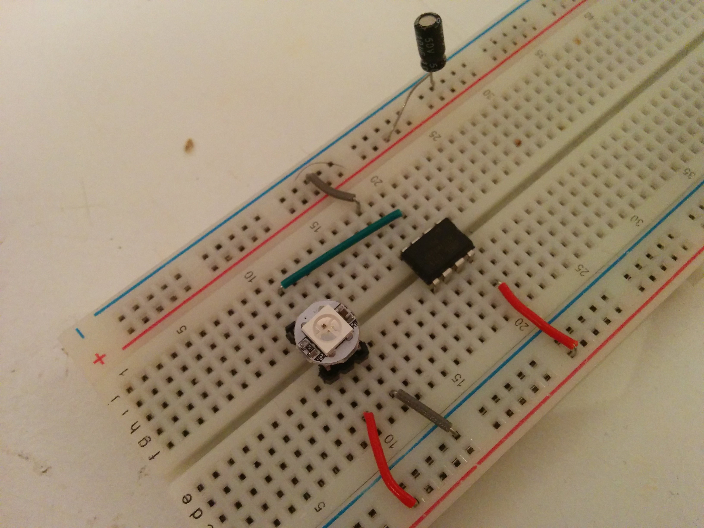

# WS2812B driver for the attiny13

The attiny13 is one of the cheapest and easy to use microcontrollers that you can probably find. It's a good solution when you only need to do a really simple task. This "library" supplies a function that can send talk to a single WS2812B led.

The WS2812B is an RBG led, which needs only one data pin from the microcontroller. It listens on its data pin and will emit the color that it receives. Such an RGB led is useful if you want to be able to provide multiple different status messages (thtough led colors), without having to sacrifice too many microcontroller pins.

## Setup

Wire everything up in a regular fashion. Connect the data pin from the WS2812B to a usable `PORTB` pin. This was my own testing setup:



## Running some code

```c
// Define the clock speed. Do not forget to unprogram the CKDIV8 fuse bit
#define F_CPU 9600000UL

// Include `ws2812b_attiny13.h`, which exposes `ws2812b_set_color`.
#include "ws2812b_attiny13.h"

// Include standard stuff
#include <inttypes.h>
#include <stdbool.h>
#include <util/delay.h>

int main() {
    // Specify the pin value using _BV()
    const uint8_t pin = _BV(PB3);
    
    // Set color to white
    ws2812b_set_color(pin, 0x55, 0x88, 0xFF);
    _delay_ms(1000);
        
    // Set color to red
    ws2812b_set_color(pin, 0xFF, 0x00, 0x00);
    _delay_ms(1000);
        
    // Set color to green
    ws2812b_set_color(pin, 0x00, 0xFF, 0x00);
    _delay_ms(1000);
        
    // Set color to blue
    ws2812b_set_color(pin, 0x00, 0x00, 0xFF);
    _delay_ms(1000);
    
    while (true) {}
}
```

I use the USB ASP programmers to flash my microcontrollers. My methods and scripts are included in a [Makefile](Makefile).

## Questions

### Where can I find the relevant datasheets?

- [Attiny13 datasheet](http://ww1.microchip.com/downloads/en/DeviceDoc/doc2535.pdf)
- [WS2812B datasheet](https://cdn-shop.adafruit.com/datasheets/WS2812B.pdf)
- [AVR assembly guide](http://academy.cba.mit.edu/classes/embedded_programming/doc1022.pdf) (for those interested in understanding the [hard parts](https://github.com/dsprenkels/ws2812b_attiny13/blob/master/ws2812b_attiny13.c#L9-L156))

### In the example, shouldn't white be `ws2812b_set_color(pin, 0xFF, 0xFF, 0xFF)`?

Not really. The WS2812B datasheet mentions that not all three color components of the light shine equally bright. Indeed, the red led shines *a lot* brighter than the blue one. You should probably compensate for this if you want to get a white light. My personal rule of thumb has been to divide the red value by 3 and the green value by 2.
